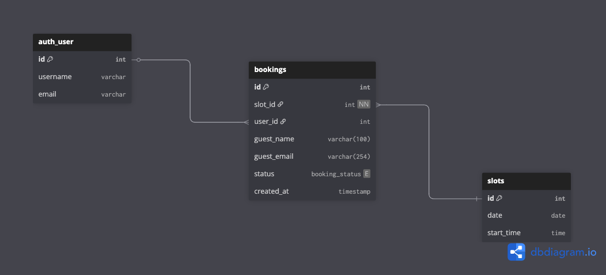

# White-Label-Booking-System
A hack-a-thon plug-and-play Django booking form app for rapid prototyping and tech demos.

[Preview Link](https://white-label-booking-system-9286cdf7aa1e.herokuapp.com/)

## Overview

This project is a white-label booking system designed to be easily integrated ("bolted on") to any Django site. It provides a simple booking form, time slot management, and guest reservation workflow. The app is ideal for demos, or as a starting point for more advanced booking solutions.

## Features

- **Bookable Items:** Define resources (tables, rooms, courts, etc.) that can be reserved.
- **Time Slot Management:** Create and manage available time slots for each item.
- **Guest Booking:** Collect guest info and allow reservations without requiring user accounts.
- **Admin Interface:** Manage items, slots, and bookings via Django admin.
- **HTMX Integration:** Dynamic booking form updates and slot availability checks.
- **Easy Bolt-On:** Minimal changes required to add to an existing Django project.

## Tech Stack

- **Python 3.13**
- **JavaScript**
- **HTML, CSS**
- **Django 4.2**
- **HTMX** (dynamic frontend interactions)
- **Bootstrap** (optional, for styling)
- **PostgreSQL**

## Quick Start

1. **Clone the repo:**
   ```sh
   git clone https://github.com/your-org/White-Label-Booking-System.git
   cd White-Label-Booking-System
   ```

2. **Install dependencies:**
   ```sh
   python -m venv .venv
   source .venv/bin/activate
   pip install -r requirements.txt
   ```

3. **Apply migrations:**
   ```sh
   python manage.py migrate
   ```

4. **Create a superuser (optional, for admin):**
   ```sh
   python manage.py createsuperuser
   ```

5. **Run the server:**
   ```sh
   python manage.py runserver
   ```

6. **Access the booking form:**
   - Visit [http://127.0.0.1:8000/](http://127.0.0.1:8000/) for the booking demo.
   - Visit `/admin/` for management.

## Usage

- Add bookable items and time slots via the admin interface.
- Guests can select a date and time slot, enter their info, and book.
- Admins can view, edit, and manage all bookings.

## Folder Structure

- `bookings/` — Main booking app (models, views, templates)
- `templates/` — Project-wide templates (base, home, allauth, etc.)
- `static/` — CSS and JS assets
- `white_label_booking/` — Project settings and root URLs

## Customization

- Extend models to add more fields (e.g., pricing, location).
- Customize templates for your brand.
- Integrate with payment or notification systems as needed.

## Design & Layout

- ERD: 
- WIREFRAME: 
- USERPATH: 
- Fonts:
- Colour palette:  

## Testing & Validation

Unit tests include:

# User Tests:

Viewing booking pages
Booking available slots
Viewing personal bookings
Cancelling bookings

# Admin Tests:

Accessing staff dashboard
Creating time slots
Cancelling user bookings
Booking for customers
Deleting slots

# Guest Tests:

Limited access to public pages
Prevented access to protected features

# Edge Cases:

Booking already booked slots
Non-existent resources
Invalid data formats
Permission violations
Duplicate creations
Missing required data

Run with: python3 manage.py test bookings

# Validation

- HTML
- CSS
- PY
- Lighthouse

## License

MIT License

---

**Demo Ready. Production Optional.**
